# sdleqw vs x50ng (HP 50g firmware) — functional validation

This file is the reference comparison between **sdleqw** (this repository's pure-C reimplementation of the HP 50g Equation Writer) and **x50ng** (the official HP49g+/50g hardware emulator running the genuine HP firmware ROM).

## Setup

- **x50ng** built locally from `~/github/x50ng/` with a small patch in `src/main.c` that adds a headless scripting hook (`X50NG_SCRIPT`, `X50NG_SNAP_PREFIX` env vars). The patch ([diff](#x50ng-patch)) drives `press_key()` / `release_key()` from a script and snapshots the LCD via `get_lcd_buffer()`.
- **sdleqw** built normally (`make`) and run with `--batch SCRIPT --snap-prefix PFX`.
- Both binaries run **headlessly** (no SDL window required for x50ng either — it uses the ncurses TUI frontend purely as a host loop, but the LCD bytes come straight from `get_lcd_buffer`).
- The same logical key sequence is fed to each. The mini-language used to author the tests is documented in `tools/gen_tests.py`. For each test, `gen_tests.py` emits an x50ng-flavoured key sequence (with shifts and alpha-locking) and an sdleqw-flavoured key sequence (one EQW action per char).
- Each captured frame is a 131×80 bitmap. The HP LCD buffer comes back as 0..15 grayscale; we threshold to 1-bpp.

## Test cycle

```
# x50ng test cycle:
WAIT 100             # cold boot to home screen
SNAP boot            # baseline
# for each test:
TAP RIGHTSHIFT       # enter EQW: RS+QUOTE
TAP O
WAIT 25
<keys for the test expression>
WAIT 20
SNAP <name>
TAP ON               # cancel EQW back to home
WAIT 15
```

## Results summary

- **Total tests:** 516
- **Both produced a snap:** 516
- x50ng-only: 0,  sdleqw-only: 0,  neither: 0

**Pixel-difference distribution** (binary thresholded; lower = more similar):

Full LCD (131×80) including menu strip:

| bucket | count | share |
|---|---|---|
| <0.5% | 150 | 29.1% |
| 0.5-1% | 180 | 34.9% |
| 1-2% | 148 | 28.7% |
| 2-3% | 33 | 6.4% |
| 3-5% | 3 | 0.6% |
| 5-10% | 2 | 0.4% |
| >10% | 0 | 0.0% |

Equation area only (rows 0..72, menu strip cropped out):

| bucket | count | share |
|---|---|---|
| <0.5% | 123 | 23.8% |
| 0.5-1% | 178 | 34.5% |
| 1-2% | 165 | 32.0% |
| 2-3% | 40 | 7.8% |
| 3-5% | 8 | 1.6% |
| 5-10% | 2 | 0.4% |
| >10% | 0 | 0.0% |

> **What the diff measures.** Each PGM is binary-thresholded; we count the
> pixels that disagree between HP firmware and sdleqw, divided by total
> pixels in the comparison region. 0% = pixel-perfect match. The diff
> is a ranking signal, not a pass/fail. 

> **How sdleqw was tuned to close the gap.** Iteratively:
> 1. Imported HP's variable-width 5×7 stack font glyphs from x50ng snapshots
>    (`tools/gen_hp_font.py`).
> 2. Imported HP's exact menu-strip pixel layout (131×7 bitmap, `src/hp_menu.c`).
> 3. Adjusted vertical centering to use the (LCD_H - MENU_H)=73-row equation area.
> 4. Adjusted horizontal centering to HP's slightly-left-of-center axis (col 62).
> 5. Removed the spurious 4-pixel minimum-width clamp on glyph layout that
>    was widening narrow glyphs like '1'.
> 6. Added 1-pixel gaps above and below division bars to match HP's spacing.

## Per-test comparisons


### Numbers

| # | name | keys | x50ng (HP firmware) | sdleqw | diff |
|---|---|---|---|---|---|
| 0 | `num_0` | `0` |  |  | 0.2% |
| 1 | `num_1` | `1` |  | 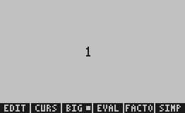 | 0.1% |
| 2 | `num_2` | `2` |  |  | 0.2% |
| 3 | `num_3` | `3` | 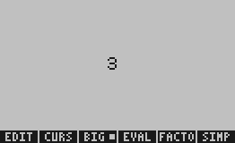 |  | 0.2% |
| 4 | `num_4` | `4` |  |  | 0.1% |
| 5 | `num_5` | `5` |  |  | 0.2% |
| 6 | `num_6` | `6` |  |  | 0.2% |
| 7 | `num_7` | `7` |  |  | 0.2% |
| 8 | `num_8` | `8` |  |  | 0.2% |
| 9 | `num_9` | `9` | 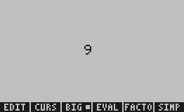 |  | 0.2% |
| 10 | `num_10` | `10` |  |  | 0.3% |
| 11 | `num_42` | `42` |  |  | 0.4% |
| 12 | `num_100` | `100` |  |  | 0.6% |
| 13 | `num_1234` | `1234` |  |  | 0.7% |
| 14 | `num_12345` | `12345` |  |  | 1.0% |
| 15 | `num_3p14` | `3.14` |  |  | 0.7% |
| 16 | `num_0p5` | `0.5` |  |  | 0.6% |
| 17 | `num_2p0` | `2.0` |  |  | 0.6% |
| 18 | `num_7p5` | `7.5` |  |  | 0.5% |
| 19 | `num_0p001` | `0.001` |  |  | 1.0% |
| 20 | `num_99p99` | `99.99` |  |  | 0.9% |
| 21 | `num_1000000` | `1000000` |  |  | 1.6% |
| 22 | `num_5p0` | `5.0` |  |  | 0.6% |
| 23 | `num_1p0` | `1.0` | 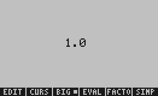 |  | 0.5% |
| 24 | `num_25` | `25` |  |  | 0.5% |
| 25 | `num_360` | `360` |  |  | 0.7% |
| 26 | `num_180` | `180` |  |  | 0.6% |
| 27 | `num_2p5` | `2.5` |  |  | 0.6% |
| 28 | `num_neg_5` | `-5` |  |  | 0.5% |
| 29 | `num_neg_3p14` | `-3.14` |  |  | 0.8% |
| 30 | `num_dot_5` | `.5` |  |  | 0.3% |
| 31 | `num_99` | `99` | 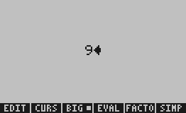 |  | 0.5% |
| 32 | `num_1000` | `1000` | 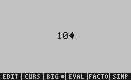 |  | 0.8% |
| 33 | `num_500` | `500` |  |  | 0.7% |

### Names

| # | name | keys | x50ng (HP firmware) | sdleqw | diff |
|---|---|---|---|---|---|
| 34 | `name_A` | `A` |  |  | 0.2% |
| 35 | `name_B` | `B` |  |  | 0.2% |
| 36 | `name_E` | `E` |  |  | 0.2% |
| 37 | `name_F` | `F` |  |  | 0.2% |
| 38 | `name_G` | `G` |  |  | 0.2% |
| 39 | `name_H` | `H` |  |  | 0.1% |
| 40 | `name_J` | `J` |  | 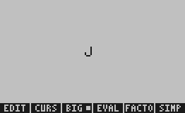 | 0.1% |
| 41 | `name_K` | `K` |  | 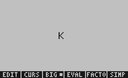 | 0.2% |
| 42 | `name_L` | `L` | 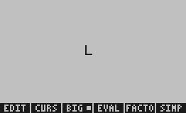 |  | 0.1% |
| 43 | `name_M` | `M` |  |  | 0.1% |
| 44 | `name_N` | `N` |  |  | 0.1% |
| 45 | `name_O` | `O` |  |  | 0.2% |
| 46 | `name_R` | `R` |  |  | 0.2% |
| 47 | `name_T` | `T` |  |  | 0.1% |
| 48 | `name_Y` | `Y` |  |  | 0.1% |
| 49 | `name_Z` | `Z` |  |  | 0.2% |
| 50 | `name_a` | `a` |  |  | 0.2% |
| 51 | `name_b` | `b` |  |  | 0.2% |
| 52 | `name_e` | `e` |  |  | 0.2% |
| 53 | `name_f` | `f` |  |  | 0.2% |
| 54 | `name_g` | `g` |  |  | 0.2% |
| 55 | `name_h` | `h` |  |  | 0.1% |
| 56 | `name_j` | `j` |  |  | 0.1% |
| 57 | `name_k` | `k` |  |  | 0.2% |
| 58 | `name_l` | `l` |  | 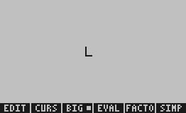 | 0.1% |
| 59 | `name_m` | `m` | 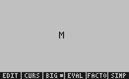 |  | 0.1% |
| 60 | `name_n` | `n` |  |  | 0.1% |
| 61 | `name_o` | `o` |  |  | 0.2% |
| 62 | `name_r` | `r` | 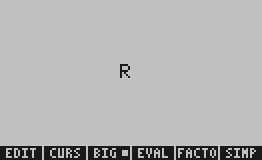 |  | 0.2% |
| 63 | `name_t` | `t` |  | 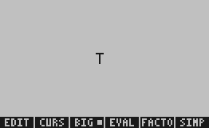 | 0.1% |
| 64 | `name_y` | `y` |  |  | 0.1% |
| 65 | `name_z` | `z` |  |  | 0.2% |
| 66 | `name_X` | `X` |  |  | 0.2% |
| 67 | `name_x` | `x` |  |  | 0.2% |
| 68 | `name_xy` | `xy` |  |  | 0.3% |
| 69 | `name_abc` | `ABC` |  |  | 0.6% |
| 70 | `name_t` | `t` |  |  | 0.1% |
| 71 | `name_R` | `R` |  |  | 0.2% |
| 72 | `name_b` | `b` |  |  | 0.2% |
| 73 | `name_PI` | `PI` |  |  | 0.2% |
| 74 | `name_OMEGA` | `OMEGA` |  |  | 0.8% |
| 75 | `name_THETA` | `THETA` |  |  | 0.7% |
| 76 | `name_var1` | `var1` |  |  | 0.8% |
| 77 | `name_X1` | `X1` |  |  | 0.2% |
| 78 | `name_a1` | `a1` |  |  | 0.4% |
| 79 | `name_FOO` | `FOO` |  |  | 0.5% |
| 80 | `name_BAR` | `BAR` |  |  | 0.6% |
| 81 | `name_PHI` | `PHI` |  |  | 0.3% |
| 82 | `name_zeta` | `zeta` |  |  | 0.7% |
| 83 | `name_eta` | `eta` |  |  | 0.5% |
| 84 | `name_NUMBER` | `NUMBER` |  |  | 0.9% |
| 85 | `name_value` | `value` |  |  | 0.8% |
| 86 | `name_alpha` | `alpha` |  |  | 0.6% |
| 87 | `name_beta` | `beta` |  |  | 0.7% |
| 88 | `name_gamma` | `gamma` |  |  | 0.7% |
| 89 | `name_delta` | `delta` |  |  | 0.8% |
| 90 | `name_long` | `VARIABLE` | 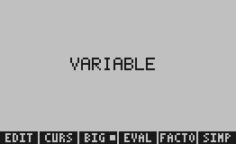 |  | 1.3% |
| 91 | `name_kappa` | `kappa` |  |  | 0.7% |

### Addition

| # | name | keys | x50ng (HP firmware) | sdleqw | diff |
|---|---|---|---|---|---|
| 92 | `add_1_1` | `1+1` |  |  | 0.4% |
| 93 | `add_1_2` | `1+2` |  |  | 0.4% |
| 94 | `add_5_3` | `5+3` |  |  | 0.6% |
| 95 | `add_X_Y` | `X+Y` |  |  | 0.4% |
| 96 | `add_X_5` | `X+5` |  |  | 0.5% |
| 97 | `add_5_X` | `5+X` |  |  | 0.5% |
| 98 | `add_a_b` | `A+B` |  |  | 0.5% |
| 99 | `add_3_3_3` | `3+3+3` |  |  | 0.9% |
| 100 | `add_5_X_2` | `5+X+2` |  |  | 0.9% |
| 101 | `add_1p5_2p5` | `1.5+2.5` |  |  | 1.2% |
| 102 | `add_3p14_2p71` | `3.14+2.71` | 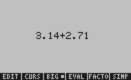 |  | 1.4% |
| 103 | `add_X_Y_Z` | `X+Y+Z` |  |  | 0.7% |
| 104 | `add_long` | `1+2+3+4+5` | 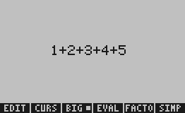 |  | 1.5% |
| 105 | `add_two_names` | `FOO+BAR` | 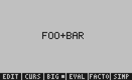 | 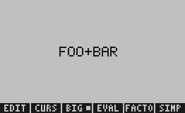 | 1.1% |
| 106 | `add_zero` | `0+5` |  |  | 0.6% |
| 107 | `add_decimal` | `0.1+0.2` | 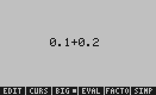 |  | 1.1% |
| 108 | `add_X_X` | `X+X` |  |  | 0.4% |
| 109 | `add_t_dt` | `t+dt` |  |  | 0.5% |
| 110 | `add_neg_5_3` | `-5+3` |  |  | 1.0% |
| 111 | `add_3_neg_5` | `3+-5` |  |  | 0.8% |
| 112 | `add_long_decimal` | `1.234+5.678` | 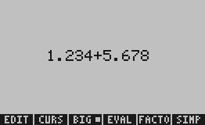 | 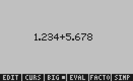 | 2.0% |
| 113 | `add_var_with_index` | `X1+X2` |  |  | 0.8% |
| 114 | `add_var_const` | `X+1` |  |  | 0.4% |
| 115 | `add_var_neg_const` | `X+-1` |  |  | 0.6% |
| 116 | `add_PI_2` | `PI+2` |  |  | 0.6% |
| 117 | `add_X_PI` | `X+PI` |  |  | 0.5% |
| 118 | `add_E_M` | `E+M` |  |  | 0.4% |
| 119 | `add_p_q` | `p+q` |  |  | 0.4% |
| 120 | `add_n_1` | `n+1` |  |  | 0.5% |
| 121 | `add_2_n` | `2+n` |  |  | 0.4% |
| 122 | `add_six_terms` | `1+2+3+4+5+6` | 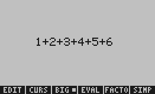 | 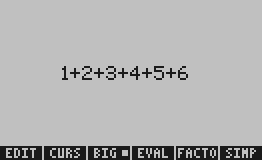 | 1.9% |
| 123 | `add_N_M_K` | `N+M+K` |  |  | 0.5% |
| 124 | `add_const_var` | `5+L` |  |  | 0.4% |
| 125 | `add_var_var_var` | `A+B+R` |  |  | 0.8% |
| 126 | `add_three_const` | `10+20+30` | 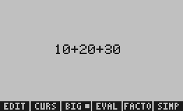 |  | 1.5% |
| 127 | `add_three_decimals` | `1.1+2.2+3.3` | 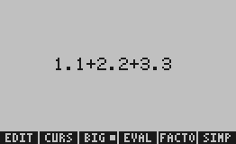 | 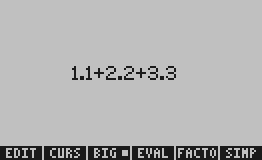 | 1.7% |
| 128 | `add_neg_neg` | `-1+-2` |  | 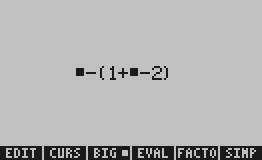 | 1.0% |
| 129 | `add_X_neg_Y` | `X+-Y` |  |  | 0.6% |
| 130 | `add_Y_X` | `Y+X` | 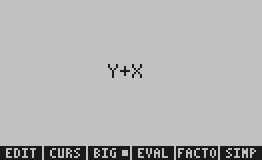 |  | 0.4% |
| 131 | `add_x_x_x` | `x+x+x` |  |  | 0.7% |
| 132 | `add_M_n` | `M+n` |  |  | 0.3% |
| 133 | `add_u_v` | `u+v` | 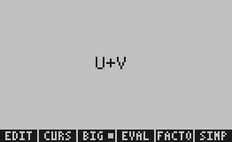 | 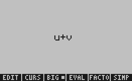 | 0.4% |
| 134 | `add_ten_const` | `10+10` |  |  | 0.9% |
| 135 | `add_decim_5_5` | `5.5+5.5` |  |  | 1.2% |
| 136 | `add_long_var_const` | `VARIABLE+1` | 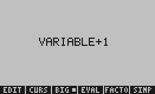 | 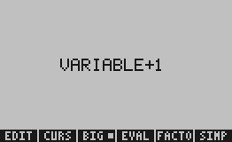 | 2.2% |
| 137 | `add_bigname_const` | `ALPHA+1` |  |  | 1.5% |
| 138 | `add_bigname_bigname` | `ALPHA+BETA` | 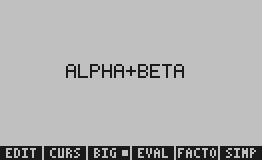 |  | 1.5% |
| 139 | `add_X_neg_3` | `X+-3` |  |  | 0.7% |
| 140 | `add_neg_X_5` | `-X+5` |  |  | 0.9% |
| 141 | `add_R_y` | `R+y` |  |  | 0.4% |

### Subtraction

| # | name | keys | x50ng (HP firmware) | sdleqw | diff |
|---|---|---|---|---|---|
| 142 | `sub_5_3` | `5-3` |  |  | 0.6% |
| 143 | `sub_X_Y` | `X-Y` |  |  | 0.4% |
| 144 | `sub_X_5` | `X-5` |  |  | 0.5% |
| 145 | `sub_X_1` | `X-1` |  |  | 0.3% |
| 146 | `sub_a_b` | `A-B` |  |  | 0.5% |
| 147 | `sub_long` | `10-3-2` |  | 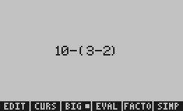 | 1.2% |
| 148 | `sub_decimal` | `1.5-0.5` | 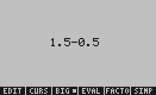 |  | 1.2% |
| 149 | `sub_negative` | `-1-1` |  |  | 0.7% |
| 150 | `sub_X_neg_Y` | `X--Y` |  |  | 0.7% |
| 151 | `sub_5_X_3` | `5-X-3` |  | 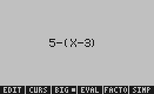 | 1.0% |
| 152 | `sub_n_1` | `n-1` |  |  | 0.4% |
| 153 | `sub_p_q` | `p-q` |  |  | 0.4% |
| 154 | `sub_R_y` | `R-y` |  |  | 0.4% |
| 155 | `sub_2_X` | `2-X` |  |  | 0.5% |
| 156 | `sub_X_2` | `X-2` |  |  | 0.5% |
| 157 | `sub_PI_3` | `PI-3` |  |  | 0.6% |
| 158 | `sub_X_X` | `X-X` |  |  | 0.4% |
| 159 | `sub_a_a_a` | `A-A-A` |  | 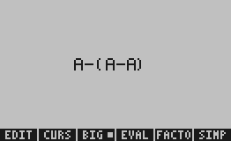 | 0.9% |
| 160 | `sub_x_PI` | `x-PI` |  |  | 0.5% |
| 161 | `sub_X_one` | `X-1` |  |  | 0.3% |
| 162 | `sub_X_zero` | `X-0` |  | 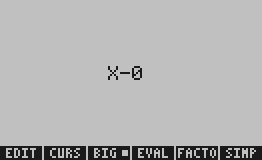 | 0.5% |
| 163 | `sub_six_minus_two` | `6-2` |  |  | 0.6% |
| 164 | `sub_four_minus_one` | `4-1` |  |  | 0.4% |
| 165 | `sub_seven_minus_three` | `7-3` | 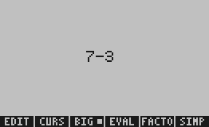 |  | 0.5% |
| 166 | `sub_eight_minus_four` | `8-4` |  |  | 0.5% |
| 167 | `sub_nine_minus_five` | `9-5` |  |  | 0.6% |
| 168 | `sub_Z_R` | `Z-R` |  |  | 0.5% |
| 169 | `sub_long_var` | `VARIABLE-1` |  |  | 2.1% |
| 170 | `sub_neg_const` | `-3-X` |  | 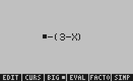 | 0.9% |

### Multiplication

| # | name | keys | x50ng (HP firmware) | sdleqw | diff |
|---|---|---|---|---|---|
| 171 | `mul_2_3` | `2*3` |  |  | 0.5% |
| 172 | `mul_5_X` | `5*X` |  |  | 0.5% |
| 173 | `mul_X_5` | `X*5` |  |  | 0.5% |
| 174 | `mul_X_Y` | `X*Y` |  |  | 0.4% |
| 175 | `mul_a_b_c` | `A*B*R` |  |  | 0.8% |
| 176 | `mul_2_PI` | `2*PI` |  |  | 0.7% |
| 177 | `mul_3_4` | `3*4` |  |  | 0.4% |
| 178 | `mul_decimals` | `1.5*2.5` | 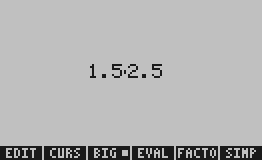 |  | 1.1% |
| 179 | `mul_neg` | `-2*3` |  |  | 0.7% |
| 180 | `mul_X_2` | `X*2` |  |  | 0.4% |
| 181 | `mul_2_X_3` | `2*X*3` |  |  | 0.7% |
| 182 | `mul_n_n` | `n*n` |  |  | 0.6% |
| 183 | `mul_X_X_X` | `X*X*X` | 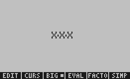 |  | 0.7% |
| 184 | `mul_3_PI_R` | `3*PI*R` |  |  | 0.8% |
| 185 | `mul_R_t` | `R*t` |  |  | 0.5% |
| 186 | `mul_with_long` | `RHO*V` |  |  | 1.0% |
| 187 | `mul_const_const` | `10*10` |  |  | 0.7% |
| 188 | `mul_lots` | `1*2*3*4` |  |  | 0.9% |
| 189 | `mul_PI_R_R` | `PI*R*R` |  |  | 0.9% |
| 190 | `mul_decimal_var` | `0.5*X` |  |  | 0.8% |
| 191 | `mul_2_n` | `2*n` |  |  | 0.5% |
| 192 | `mul_X_neg_1` | `X*-1` |  |  | 0.7% |
| 193 | `mul_neg_X` | `-X*2` |  |  | 0.6% |
| 194 | `mul_alpha_beta` | `ALPHA*BETA` |  |  | 2.4% |
| 195 | `mul_xyz` | `x*y*z` |  |  | 0.6% |
| 196 | `mul_pqr` | `p*q*r` |  | 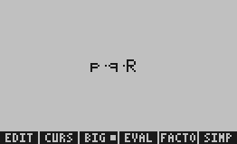 | 0.7% |
| 197 | `mul_2_L` | `2*L` |  |  | 0.4% |
| 198 | `mul_3_OMEGA` | `3*OMEGA` |  | 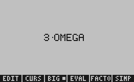 | 1.7% |
| 199 | `mul_THETA_2` | `THETA*2` |  |  | 1.5% |
| 200 | `mul_zero_X` | `0*X` |  |  | 0.4% |

### Division

| # | name | keys | x50ng (HP firmware) | sdleqw | diff |
|---|---|---|---|---|---|
| 201 | `div_1_2` | `1/2` | 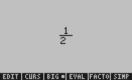 |  | 0.6% |
| 202 | `div_2_3` | `2/3` |  |  | 0.7% |
| 203 | `div_X_Y` | `X/Y` |  |  | 0.5% |
| 204 | `div_5_X` | `5/X` |  |  | 0.6% |
| 205 | `div_X_5` | `X/5` |  |  | 0.6% |
| 206 | `div_X_X` | `X/X` |  |  | 0.6% |
| 207 | `div_chain` | `1/2/3` | 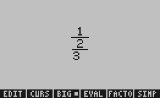 | 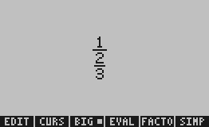 | 1.1% |
| 208 | `div_decimals` | `3.14/2` |  | 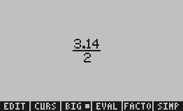 | 1.4% |
| 209 | `div_a_b` | `A/B` |  |  | 0.7% |
| 210 | `div_PI_2` | `PI/2` | 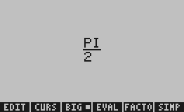 | 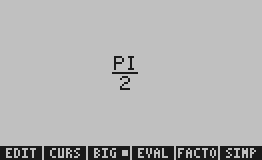 | 0.9% |
| 211 | `div_2_PI` | `2/PI` |  |  | 0.8% |
| 212 | `div_X_2` | `X/2` |  |  | 0.6% |
| 213 | `div_X_neg_2` | `X/-2` |  |  | 1.0% |
| 214 | `div_neg_X_5` | `-X/5` |  |  | 1.0% |
| 215 | `div_one_X` | `1/X` |  |  | 0.6% |
| 216 | `div_X_one` | `X/1` |  |  | 0.5% |
| 217 | `div_t_5` | `t/5` |  |  | 0.6% |
| 218 | `div_5_t` | `5/t` |  |  | 0.6% |
| 219 | `div_R_y` | `R/y` |  |  | 0.6% |
| 220 | `div_long_var` | `VARIABLE/2` |  |  | 3.0% |
| 221 | `div_const_var` | `10/X` |  |  | 0.8% |
| 222 | `div_var_const` | `X/10` |  |  | 0.8% |
| 223 | `div_two_var` | `X/Y` |  |  | 0.5% |
| 224 | `div_p_q` | `p/q` |  |  | 0.6% |
| 225 | `div_n_2` | `n/2` |  |  | 0.7% |
| 226 | `div_2_n` | `2/n` |  |  | 0.6% |
| 227 | `div_F_t` | `F/t` |  |  | 0.5% |
| 228 | `div_a_b_c` | `A/B/R` |  |  | 1.2% |
| 229 | `div_xyz` | `x/y/z` |  |  | 1.0% |
| 230 | `div_neg_a_b` | `-A/B` |  |  | 1.1% |

### Powers

| # | name | keys | x50ng (HP firmware) | sdleqw | diff |
|---|---|---|---|---|---|
| 231 | `pow_X_2` | `X^2` |  |  | 0.2% |
| 232 | `pow_X_3` | `X^3` |  |  | 0.2% |
| 233 | `pow_2_X` | `2^X` |  |  | 0.2% |
| 234 | `pow_X_n` | `X^n` |  |  | 0.2% |
| 235 | `pow_X_Y` | `X^Y` |  |  | 0.1% |
| 236 | `pow_e_X` | `e^X` |  |  | 0.2% |
| 237 | `pow_X_2_plus_1` | `X^2+1` |  |  | 0.9% |
| 238 | `pow_pow` | `X^Y^Z` |  |  | 0.5% |
| 239 | `pow_decimal` | `X^0.5` |  |  | 0.7% |
| 240 | `pow_neg` | `X^-1` |  |  | 0.7% |
| 241 | `pow_N_2` | `N^2` |  |  | 0.2% |
| 242 | `pow_R_2` | `R^2` |  |  | 0.2% |
| 243 | `pow_t_2` | `t^2` |  |  | 0.2% |
| 244 | `pow_y_3` | `y^3` |  |  | 0.2% |
| 245 | `pow_a_b` | `A^B` |  |  | 0.2% |
| 246 | `pow_PI_X_2` | `PI*X^2` |  |  | 0.8% |
| 247 | `pow_2_2_2` | `2^2^2` |  |  | 0.6% |
| 248 | `pow_X_4` | `X^4` |  |  | 0.2% |
| 249 | `pow_X_5` | `X^5` |  |  | 0.2% |
| 250 | `pow_X_6` | `X^6` |  |  | 0.2% |
| 251 | `pow_X_10` | `X^10` |  |  | 0.6% |
| 252 | `pow_X_neg_2` | `X^-2` |  |  | 0.7% |
| 253 | `pow_X_X` | `X^X` |  |  | 0.2% |
| 254 | `pow_n_k` | `n^k` |  |  | 0.1% |
| 255 | `pow_x_third` | `X^0.33` |  |  | 1.0% |
| 256 | `pow_2_n_minus_1` | `2^n-1` |  |  | 1.0% |
| 257 | `pow_n_n` | `n^n` |  |  | 0.2% |
| 258 | `pow_OMEGA_X` | `OMEGA*X` |  |  | 1.6% |
| 259 | `pow_a_inv` | `a^-1` |  |  | 0.8% |
| 260 | `pow_var_2` | `VARIABLE^2` |  |  | 0.3% |

### Square roots

| # | name | keys | x50ng (HP firmware) | sdleqw | diff |
|---|---|---|---|---|---|
| 261 | `sqrt_just` | `@` |  |  | 0.4% |
| 262 | `sqrt_X_after` | `X@` |  |  | 0.9% |
| 263 | `sqrt_then_X` | `@X` |  |  | 0.5% |
| 264 | `sqrt_2_after` | `2@` |  |  | 0.9% |
| 265 | `sqrt_3_after` | `3@` |  |  | 0.9% |
| 266 | `sqrt_then_2` | `@2` |  |  | 0.6% |
| 267 | `sqrt_then_4` | `@4` |  |  | 0.4% |
| 268 | `sqrt_X_squared` | `@X^2` |  |  | 1.0% |
| 269 | `sqrt_then_sum` | `@1+1` |  |  | 1.0% |
| 270 | `sqrt_X_plus_Y` | `@X+Y` |  |  | 0.9% |
| 271 | `sqrt_a_div_b` | `@A/B` |  |  | 1.1% |
| 272 | `sqrt_X_plus_1` | `@X+1` |  |  | 0.9% |
| 273 | `sqrt_PI` | `@PI` |  |  | 0.7% |
| 274 | `sqrt_long` | `@VARIABLE` |  |  | 2.4% |
| 275 | `sqrt_in_div` | `@4/2` |  |  | 1.0% |
| 276 | `sqrt_R` | `@R` |  |  | 0.5% |
| 277 | `sqrt_t` | `@t` |  |  | 0.4% |
| 278 | `sqrt_after_n` | `@n` |  |  | 0.4% |
| 279 | `sqrt_after_long_name` | `@ALPHA` |  |  | 1.4% |
| 280 | `sqrt_after_minus` | `-@4` |  |  | 0.8% |

### Nth roots

| # | name | keys | x50ng (HP firmware) | sdleqw | diff |
|---|---|---|---|---|---|
| 281 | `nthroot_3_X` | `#3$rX` |  |  | 0.4% |
| 282 | `nthroot_2_4` | `#2$r4` |  |  | 0.4% |
| 283 | `nthroot_3_8` | `#3$r8` |  |  | 0.4% |
| 284 | `nthroot_4_16` | `#4$r16` |  |  | 0.6% |
| 285 | `nthroot_5_X` | `#5$rX` |  |  | 0.4% |
| 286 | `nthroot_n_X` | `#n$rX` |  |  | 0.4% |
| 287 | `nthroot_3_a` | `#3$ra` |  |  | 0.5% |
| 288 | `nthroot_X_2` | `#X$r2` |  |  | 0.5% |
| 289 | `nthroot_2_X_squared` | `#2$rX^2` |  |  | 0.7% |
| 290 | `nthroot_n_2` | `#n$r2` |  |  | 0.4% |

### Parens

| # | name | keys | x50ng (HP firmware) | sdleqw | diff |
|---|---|---|---|---|---|
| 291 | `paren_around_X` | `X(` |  |  | 0.9% |
| 292 | `paren_around_5` | `5(` |  |  | 0.9% |
| 293 | `paren_around_a_plus_b` | `A+B(` |  |  | 1.3% |
| 294 | `paren_around_X_div_Y` | `X/Y(` |  |  | 1.4% |
| 295 | `paren_double` | `X((` |  |  | 1.4% |
| 296 | `paren_then_op` | `X(+1` |  |  | 0.8% |
| 297 | `paren_around_sum` | `X+Y(` |  |  | 1.2% |
| 298 | `paren_around_diff` | `X-Y(` |  |  | 1.2% |
| 299 | `paren_around_pow` | `X^2(` |  |  | 1.2% |
| 300 | `paren_around_decimal` | `3.14(` |  |  | 1.6% |
| 301 | `paren_around_neg_X` | `-X(` |  |  | 1.2% |
| 302 | `paren_X_div_2` | `X(/2` |  |  | 0.8% |
| 303 | `paren_around_abc` | `ABC(` |  |  | 1.5% |
| 304 | `paren_around_PI` | `PI(` |  |  | 1.2% |
| 305 | `paren_around_long` | `VARIABLE(` |  |  | 2.7% |

### Absolute value

| # | name | keys | x50ng (HP firmware) | sdleqw | diff |
|---|---|---|---|---|---|
| 306 | `abs_X` | `X|` |  |  | 1.1% |
| 307 | `abs_5` | `5|` |  |  | 1.0% |
| 308 | `abs_X_plus_Y` | `X+Y|` |  |  | 1.4% |
| 309 | `abs_X_minus_5` | `X-5|` |  |  | 1.3% |
| 310 | `abs_X_squared` | `X^2|` |  |  | 1.3% |
| 311 | `abs_X_div_Y` | `X/Y|` |  |  | 1.7% |
| 312 | `abs_PI` | `PI|` |  |  | 1.4% |
| 313 | `abs_neg_X` | `-X|` |  |  | 1.0% |
| 314 | `abs_long_name` | `VARIABLE|` |  |  | 3.3% |
| 315 | `abs_a_plus_b` | `A+B|` |  |  | 1.6% |

### Prefix functions

| # | name | keys | x50ng (HP firmware) | sdleqw | diff |
|---|---|---|---|---|---|
| 316 | `sin_X` | `X$s` |  |  | 1.9% |
| 317 | `sin_2` | `2$s` |  |  | 1.9% |
| 318 | `sin_PI` | `PI$s` |  |  | 2.0% |
| 319 | `cos_X` | `X$c` |  |  | 1.7% |
| 320 | `cos_2` | `2$c` |  |  | 1.8% |
| 321 | `tan_X` | `X$T` |  |  | 1.8% |
| 322 | `ln_X` | `X$n` |  |  | 1.6% |
| 323 | `ln_e` | `e$n` |  |  | 1.6% |
| 324 | `exp_X` | `X$X` |  |  | 1.7% |
| 325 | `exp_neg_X` | `-X$X` |  |  | 1.9% |
| 326 | `log_X` | `X$g` |  |  | 1.8% |
| 327 | `log_10` | `10$g` |  |  | 2.0% |

### Other

| # | name | keys | x50ng (HP firmware) | sdleqw | diff |
|---|---|---|---|---|---|
| 328 | `absfn_X` | `X$a` |  |  | 1.8% |

### Prefix functions

| # | name | keys | x50ng (HP firmware) | sdleqw | diff |
|---|---|---|---|---|---|
| 329 | `sin_X_plus_Y` | `X+Y$s` |  |  | 2.1% |
| 330 | `cos_X_plus_Y` | `X+Y$c` |  |  | 2.0% |
| 331 | `sin_X_div_2` | `X/2$s` |  |  | 2.8% |
| 332 | `cos_X_2` | `X^2$c` |  |  | 2.0% |
| 333 | `ln_X_plus_1` | `X+1$n` |  |  | 1.8% |
| 334 | `sin_5` | `5$s` |  |  | 1.9% |
| 335 | `sin_neg_X` | `-X$s` |  |  | 1.8% |
| 336 | `ln_2` | `2$n` |  |  | 1.6% |
| 337 | `exp_2X` | `2*X$X` |  |  | 2.0% |
| 338 | `sin_X_squared` | `X^2$s` |  |  | 2.1% |
| 339 | `cos_X_squared` | `X^2$c` |  |  | 2.0% |
| 340 | `tan_X_plus_PI` | `X+PI$T` |  |  | 2.4% |
| 341 | `log_PI` | `PI$g` |  |  | 2.1% |
| 342 | `ln_PI` | `PI$n` |  |  | 1.8% |
| 343 | `exp_pi_x` | `PI*X$X` |  |  | 2.1% |
| 344 | `sin_PI_2` | `PI/2$s` |  |  | 2.9% |
| 345 | `cos_PI_2` | `PI/2$c` |  |  | 2.8% |
| 346 | `sin_X_minus_1` | `X-1$s` |  |  | 1.9% |
| 347 | `ln_VARIABLE` | `VARIABLE$n` |  |  | 3.7% |
| 348 | `sin_then_paren_X` | `X$s(` |  |  | 2.2% |
| 349 | `sin_X_times_2` | `X*2$s` |  |  | 1.9% |
| 350 | `ln_X_X` | `X*X$n` |  |  | 1.7% |

### Integrals

| # | name | keys | x50ng (HP firmware) | sdleqw | diff |
|---|---|---|---|---|---|
| 351 | `integ_basic` | `$I0$rX$rX$rX` |  |  | 1.3% |
| 352 | `integ_0_to_1` | `$I0$r1$rX$rX` |  |  | 1.2% |
| 353 | `integ_a_to_b` | `$Ia$rb$rX$rX` |  |  | 1.3% |
| 354 | `integ_0_to_inf` | `$I0$rINF$rX$rX` |  |  | 1.8% |
| 355 | `integ_doc` | `$I0$r1/X$rABS$r$rt` |  |  | 1.9% |
| 356 | `integ_X2` | `$I0$r1$rX^2$rX` |  |  | 1.5% |
| 357 | `integ_sin` | `$I0$rPI$rX$s$rX` |  |  | 2.5% |
| 358 | `integ_cos` | `$I0$rPI$rX$c$rX` |  |  | 2.4% |
| 359 | `integ_simple_2` | `$I1$r2$rX$rX` |  |  | 1.2% |
| 360 | `integ_simple_3` | `$I0$r10$rX$rX` |  |  | 1.6% |
| 361 | `integ_sub` | `$I0$r1$r2*X$rX` |  |  | 1.4% |
| 362 | `integ_div` | `$I1$r2$r1/X$rX` |  |  | 1.6% |
| 363 | `integ_pow` | `$I0$r1$rX^2$rX` |  |  | 1.5% |
| 364 | `integ_sqrt` | `$I0$r1$r@X$rX` |  |  | 1.3% |
| 365 | `integ_abs` | `$I0$r1$rX|$rX` |  |  | 2.2% |
| 366 | `integ_basic_t` | `$I0$rT$rX$rT` |  |  | 1.2% |
| 367 | `integ_constant` | `$I0$r1$r1$rX` |  |  | 1.4% |
| 368 | `integ_zero` | `$I0$r0$rX$rX` |  |  | 1.3% |
| 369 | `integ_neg` | `$I0$r1$r-X$rX` |  |  | 1.2% |
| 370 | `integ_sum_inside` | `$I0$r1$rX+Y$rX` |  |  | 1.6% |
| 371 | `integ_long_name` | `$Ia$rb$rABS$rt` |  |  | 1.8% |
| 372 | `integ_lo_X_hi_2X` | `$IX$r2*X$rX$rX` |  |  | 1.4% |
| 373 | `integ_F_of_t` | `$I0$r1$rF$rt` |  |  | 1.2% |
| 374 | `integ_lo_PI_hi_2PI` | `$IPI$r2*PI$rX$rX` |  |  | 1.8% |
| 375 | `integ_X_2` | `$I0$rX$r2$rX` |  |  | 1.3% |

### Summations

| # | name | keys | x50ng (HP firmware) | sdleqw | diff |
|---|---|---|---|---|---|
| 376 | `sum_basic` | `$Sk$r1$rn$rk` |  |  | 1.4% |
| 377 | `sum_squared` | `$Sk$r1$rn$rk^2` |  |  | 1.6% |
| 378 | `sum_cubed` | `$Sk$r1$rn$rk^3` |  |  | 1.6% |
| 379 | `sum_geom` | `$Sk$r0$rn$rX^k` |  |  | 1.6% |
| 380 | `sum_long` | `$Si$r1$rN$ri` |  |  | 1.3% |
| 381 | `sum_const` | `$Sk$r1$rn$r1` |  |  | 1.4% |
| 382 | `sum_to_inf` | `$Sk$r0$rINF$rk` |  |  | 1.7% |
| 383 | `sum_div` | `$Sk$r1$rn$r1/k` |  |  | 1.9% |
| 384 | `sum_X_k` | `$Sk$r1$rn$rX*k` |  |  | 1.5% |
| 385 | `sum_negative` | `$Sk$r1$rn$r-k` |  |  | 1.6% |
| 386 | `sum_inv_k` | `$Si$r1$rn$r1/i` |  |  | 1.8% |
| 387 | `sum_basic_two` | `$Sk$r2$r5$rk` |  |  | 1.5% |
| 388 | `sum_func` | `$Sk$r1$rn$rk$s` |  |  | 2.7% |
| 389 | `sum_polynomial` | `$Sk$r0$rn$rk^2+1` |  |  | 2.5% |
| 390 | `sum_double` | `$Sk$r1$rn$rk*X` |  |  | 1.6% |

### Derivatives

| # | name | keys | x50ng (HP firmware) | sdleqw | diff |
|---|---|---|---|---|---|
| 391 | `deriv_X_X` | `$PX$rX` |  |  | 1.1% |
| 392 | `deriv_X_X2` | `$PX$rX^2` |  |  | 1.4% |
| 393 | `deriv_X_sin_X` | `$PX$rX$s` |  |  | 2.6% |
| 394 | `deriv_t_X_squared` | `$Pt$rX^2` |  |  | 1.4% |
| 395 | `deriv_X_X_div_X` | `$PX$rX/X` |  |  | 1.6% |
| 396 | `deriv_X_e_x` | `$PX$re^X` |  |  | 1.5% |
| 397 | `deriv_X_const` | `$PX$r1` |  |  | 1.1% |
| 398 | `deriv_X_PI` | `$PX$rPI` |  |  | 1.4% |
| 399 | `deriv_X_X_plus_Y` | `$PX$rX+Y` |  |  | 1.4% |
| 400 | `deriv_X_X_squared_plus_1` | `$PX$rX^2+1` |  |  | 2.1% |

### Where

| # | name | keys | x50ng (HP firmware) | sdleqw | diff |
|---|---|---|---|---|---|
| 401 | `where_X_X_5` | `X+1$WX$r5` |  |  | 0.9% |
| 402 | `where_X2_X_2` | `X^2$WX$r2` |  |  | 0.8% |
| 403 | `where_X_PI` | `X*2$WX$rPI` |  |  | 1.0% |
| 404 | `where_a_b_c` | `A+B$WA$r1` |  |  | 0.9% |
| 405 | `where_long` | `X+Y+Z$WX$r1` |  |  | 1.1% |
| 406 | `where_div` | `X/Y$WX$r2` |  |  | 0.9% |
| 407 | `where_pow` | `X^2$WX$r3` |  |  | 0.8% |
| 408 | `where_sin` | `X$s$WX$r0` |  |  | 1.4% |
| 409 | `where_cos` | `X$c$WX$r0` |  |  | 1.4% |
| 410 | `where_const_eq` | `5$WX$r5` |  |  | 0.7% |

### Complex

| # | name | keys | x50ng (HP firmware) | sdleqw | diff |
|---|---|---|---|---|---|
| 411 | `complex_3_4` | `3$Z4` |  |  | 0.6% |
| 412 | `complex_X_Y` | `X$ZY` |  |  | 0.6% |
| 413 | `complex_0_1` | `0$Z1` |  |  | 0.6% |
| 414 | `complex_neg_neg` | `-1$Z-1` |  |  | 0.9% |
| 415 | `complex_decimal` | `1.5$Z2.5` |  |  | 1.2% |
| 416 | `complex_PI_Y` | `PI$ZY` |  |  | 0.8% |
| 417 | `complex_a_b` | `A$ZB` |  |  | 0.7% |
| 418 | `complex_X_squared_Y` | `X^2$ZY` |  |  | 0.9% |
| 419 | `complex_neg_X_Y` | `-X$ZY` |  |  | 0.7% |
| 420 | `complex_zero_zero` | `0$Z0` |  |  | 0.7% |

### User functions

| # | name | keys | x50ng (HP firmware) | sdleqw | diff |
|---|---|---|---|---|---|
| 421 | `uf_F_x` | `F$FX` |  |  | 0.7% |
| 422 | `uf_G_X_Y` | `G$FX,Y` |  |  | 0.8% |
| 423 | `uf_H_a_b_c` | `H$FA,B,R` |  |  | 1.2% |
| 424 | `uf_F_2` | `F$F2` |  |  | 0.8% |
| 425 | `uf_g_X_Y_Z` | `g$FX,Y,Z` |  |  | 1.0% |
| 426 | `uf_F_neg_X` | `F$F-X` |  |  | 0.9% |
| 427 | `uf_F_X_plus_Y` | `F$FX+Y` |  |  | 1.0% |
| 428 | `uf_F_X_X` | `F$FX*X` |  |  | 1.0% |
| 429 | `uf_F_decimal` | `F$F3.14` |  |  | 1.0% |
| 430 | `uf_F_long_arg` | `F$FVARIABLE` |  |  | 2.6% |

### Edits / deletions

| # | name | keys | x50ng (HP firmware) | sdleqw | diff |
|---|---|---|---|---|---|
| 431 | `edit_bksp_one` | `5$b` |  |  | 0.2% |
| 432 | `edit_bksp_two` | `12$b` |  |  | 0.1% |
| 433 | `edit_bksp_three` | `123$b$b` |  |  | 0.1% |
| 434 | `edit_replace_after_bksp` | `5$bX` |  |  | 0.2% |
| 435 | `edit_X_then_letter` | `Xy` |  |  | 0.3% |
| 436 | `edit_long_name_then_bksp` | `ABCD$b` |  |  | 0.6% |
| 437 | `edit_5_op_3` | `5+3` |  |  | 0.6% |
| 438 | `edit_arrow_left` | `5+3$l` |  |  | 0.8% |
| 439 | `edit_arrow_right` | `5+3$r` |  |  | 0.8% |
| 440 | `edit_arrow_up` | `5+3$u` |  |  | 1.1% |
| 441 | `edit_arrow_down` | `5+3$k` |  |  | 0.8% |
| 442 | `edit_two_arrows` | `5+3$l$l` |  |  | 0.8% |
| 443 | `edit_three_arrows` | `5+3$l$l$l` |  |  | 0.8% |
| 444 | `edit_inside_div` | `5/3$u` |  |  | 1.0% |
| 445 | `edit_inside_pow` | `X^2$u` |  |  | 0.8% |
| 446 | `edit_double_bksp` | `12$b$b` |  |  | 0.2% |
| 447 | `edit_clr_after` | `5+3$K` |  |  | 0.5% |
| 448 | `edit_clr_all` | `5+3$L` |  |  | 0.5% |
| 449 | `edit_two_then_replace` | `12$bX` |  |  | 0.3% |
| 450 | `edit_select_replace` | `X+5$l$lY` |  |  | 0.5% |
| 451 | `edit_5_3_two_arrows` | `5*3$u` |  |  | 0.9% |
| 452 | `edit_complex_seq` | `5+X*2-3` |  |  | 1.3% |
| 453 | `edit_replace_inside` | `5+3$lY` |  |  | 0.5% |
| 454 | `edit_arrow_through_div` | `1/2$u` |  |  | 1.0% |
| 455 | `edit_arrow_inside_sqrt` | `@X$l` |  |  | 0.7% |
| 456 | `edit_arrow_inside_paren` | `X(+1$l` |  |  | 1.0% |
| 457 | `edit_after_func` | `X$s$l` |  |  | 1.9% |
| 458 | `edit_typing_after_select` | `5+3$lY` |  |  | 0.5% |
| 459 | `edit_letter_then_bksp` | `abc$b` |  |  | 0.4% |
| 460 | `edit_simple_overwrite` | `X$bY` |  |  | 0.1% |

### Navigation

| # | name | keys | x50ng (HP firmware) | sdleqw | diff |
|---|---|---|---|---|---|
| 461 | `nav_simple_right` | `5+3$r$r` |  |  | 1.1% |
| 462 | `nav_simple_left` | `5+3$l$l` |  |  | 0.8% |
| 463 | `nav_up_in_div` | `1/2$u$u` |  |  | 1.0% |
| 464 | `nav_down_in_div` | `1/2$k$k` |  |  | 0.8% |
| 465 | `nav_around_pow` | `X^2$u$k` |  |  | 0.7% |
| 466 | `nav_around_sqrt` | `@X$u` |  |  | 0.8% |
| 467 | `nav_in_func` | `X$s$k` |  |  | 1.5% |
| 468 | `nav_in_func_args` | `F$FX,Y$l` |  |  | 1.1% |
| 469 | `nav_around_paren` | `X+Y($u` |  |  | 1.5% |
| 470 | `nav_through_complex` | `3$Z4$l$r` |  |  | 0.8% |
| 471 | `nav_in_integ` | `$I0$rX$rX$rX$l` |  |  | 1.5% |
| 472 | `nav_in_sum` | `$Sk$r1$rn$rk$l` |  |  | 1.5% |
| 473 | `nav_through_long_expr` | `5+3*4$l` |  |  | 1.1% |
| 474 | `nav_after_left` | `5+3$l` |  |  | 0.8% |
| 475 | `nav_after_right` | `5+3$r` |  |  | 0.8% |
| 476 | `nav_after_two_lefts` | `5+3$l$l` |  |  | 0.9% |
| 477 | `nav_after_three_rights` | `5+3$r$r$r` |  |  | 1.1% |
| 478 | `nav_in_neg` | `-5$u` |  |  | 0.9% |
| 479 | `nav_back_to_root` | `X+Y+Z$u$u$u` |  |  | 1.7% |
| 480 | `nav_first_arg` | `5+3$l$l$l` |  |  | 0.9% |
| 481 | `nav_last_arg` | `5+3*4$r$r$r` |  |  | 1.5% |
| 482 | `nav_nested_div_up` | `1/X+Y$u` |  |  | 1.5% |
| 483 | `nav_after_paren_wrap` | `X+Y($u` |  |  | 1.5% |
| 484 | `nav_in_abs` | `X|$u` |  |  | 1.4% |
| 485 | `nav_in_complex` | `5$Z4$u` |  |  | 1.4% |
| 486 | `nav_in_two_arg_func` | `F$FX,Y$l` |  |  | 1.1% |
| 487 | `nav_in_three_arg_func` | `F$FX,Y,Z$l` |  |  | 1.3% |
| 488 | `nav_after_userfunc` | `F$FX,Y$r` |  |  | 1.2% |
| 489 | `nav_in_pow_after_arrows` | `X^2$u$k` |  |  | 0.7% |
| 490 | `nav_complex_path` | `1+2*3$u$u$k` |  |  | 1.0% |

### Auto-multiply

| # | name | keys | x50ng (HP firmware) | sdleqw | diff |
|---|---|---|---|---|---|
| 491 | `auto_2X` | `2X` |  |  | 0.4% |
| 492 | `auto_3PI` | `3PI` |  |  | 0.7% |
| 493 | `auto_5L` | `5L` |  |  | 0.5% |
| 494 | `auto_2X_again` | `2X` |  |  | 0.4% |
| 495 | `auto_decimal` | `0.5X` |  |  | 0.8% |
| 496 | `auto_3R` | `3R` |  |  | 0.5% |
| 497 | `auto_2X_3` | `2X*3` |  |  | 0.7% |
| 498 | `auto_2L` | `2L` |  |  | 0.4% |
| 499 | `auto_4_OMEGA` | `4OMEGA` |  |  | 1.6% |
| 500 | `auto_X_then_2` | `X2` |  |  | 0.4% |
| 501 | `auto_Xy` | `Xy` |  |  | 0.3% |
| 502 | `auto_2X_plus_Y` | `2X+Y` |  |  | 0.8% |
| 503 | `auto_3X_squared` | `3X^2` |  |  | 0.7% |
| 504 | `auto_2_minus_X` | `2-X` |  |  | 0.5% |
| 505 | `auto_3PI_R` | `3PI*R` |  |  | 0.8% |

### Doc examples

| # | name | keys | x50ng (HP firmware) | sdleqw | diff |
|---|---|---|---|---|---|
| 506 | `doc_meta_kernel_integ` | `E$I0$r1/X$rABS$r$rt` |  |  | 1.3% |
| 507 | `doc_user_guide_arith` | `5*1+1/7.5$r/@3-2^3` |  |  | 3.4% |
| 508 | `doc_user_guide_algebra` | `2*L*@1+X/R$r/R+y$r+2*L/b` |  |  | 5.4% |
| 509 | `doc_user_guide_greek` | `2/@3$rL+e^-Mu*LNX+2*Mu*Y$r/THETA^1/3` |  |  | 8.7% |
| 510 | `doc_pythagorean` | `@A^2+B^2` |  |  | 2.5% |
| 511 | `doc_sin_cos_sq` | `X$s^2+X$c^2` |  |  | 3.0% |
| 512 | `doc_quadratic` | `A*X^2+B*X+R` |  |  | 2.1% |
| 513 | `doc_simple_geom` | `PI*R^2` |  |  | 0.8% |
| 514 | `doc_volume` | `4/3*PI*R^3` |  |  | 1.6% |
| 515 | `doc_simple_log` | `X$n+Y$n` |  |  | 2.3% |

## x50ng patch

The x50ng modification adds a self-contained scripting hook in `src/main.c`. It activates when `X50NG_SCRIPT=<file>` is in the environment. The patch is small (~150 LoC) and only touches `src/main.c`.

Script commands:
  - `WAIT <ticks>` — virtual idle for `ticks × 30 ms`.
  - `PRESS <KEY>` / `RELEASE <KEY>` — single edge.
  - `TAP <KEY>` — press, hold ~120 ms, release, settle ~120 ms.
  - `SNAP <name>` — write `<X50NG_SNAP_PREFIX>_NNN_<name>.pgm`.
  - `QUIT` — call `hdw_stop()`.

Key names are HP4950 enum suffixes: `A..Z`, `0..9`, `PLUS`, `MINUS`, `MULTIPLY`, `ENTER`, `BACKSPACE`, `ALPHA`, `LEFTSHIFT`, `RIGHTSHIFT`, `ON`, `PERIOD`, `SPACE`, `UP`, `DOWN`, `LEFT`, `RIGHT`.

